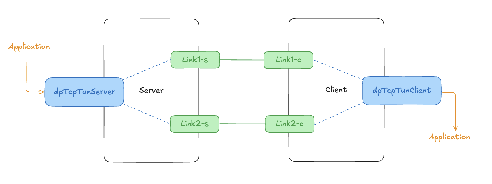

# dp-tcp

**Dual Path TCP**: A application for dual path TCP

Dual-Path at here means the packet will be ensure by double transmit.

## Description



As the dp-tcp started, it will create a network interface for proxy real data packe. At the above image, packet from blue network interface to green network interface is doing packet duplication, and the packet from green network interface to blue network interface is doing packet elimination.

For duplication, it just duplicate the packet read from blue network interface and write to both TCP links.

For elimination, dp-tcp used a [hashmap](github.com/cornelk/hashmap) to store packet record. This map is efficient and safe for doing concurent map read/write. The record stored in the map is not the original raw packet since it may be very large. dp-tcp used [xxhash](github.com/cornelk/hashmap), a quick hash function, for hashing the packet into an `uint64` value, which makes it easy stored.

With using [hashmap](github.com/cornelk/hashmap) and [xxhash](github.com/cornelk/hashmap), this dp-tcp is achieve a very efficient way to manage packets and connection reliable.

## Usage

```bash
git clone git@github.com:Alonza0314/dp-tcp.git
cd dp-tcp
make
```

- Server

    ```bash
    sudo ./build/dp-tcp server -c config/server.yaml
    ```

- Client

    ```bash
    sudo ./build/dp-tcp client -c config/client.yaml
    ```

## Quickstart

1. Clone and make

    ```bash
    git clone git@github.com:Alonza0314/dp-tcp.git
    cd dp-tcp
    make
    ```

2. Start and enter namespace

    - Start

        ```bash
        ./namespace.sh up
        ```

    - Server-ns

        ```bash
        ./namespace.sh server-ns

        # after enter namespace
        ./build/dp-tcp server -c config/server.yaml
        ```

    - Client-ns

        ```bash
        ./namespace.sh client-ns

        # after enter namespace
        ./build/dp-tcp client -c config/client.yaml
        ```

    - Demo

        

3. ncat test

    - Server

        ```bash
        ncat -u -l 10.0.0.1 9999
        ```

    - Client

        ```bash
        ncat -u --source 10.0.0.2 10.0.0.1 9999
        ```

    - Demo

        

## Appendix

- "github.com/songgao/water": used to bring up network device.
- "github.com/cornelk/hashmap": safe concurrent map.
- "github.com/cespare/xxhash/v2": quick hash for operating packet hashing
