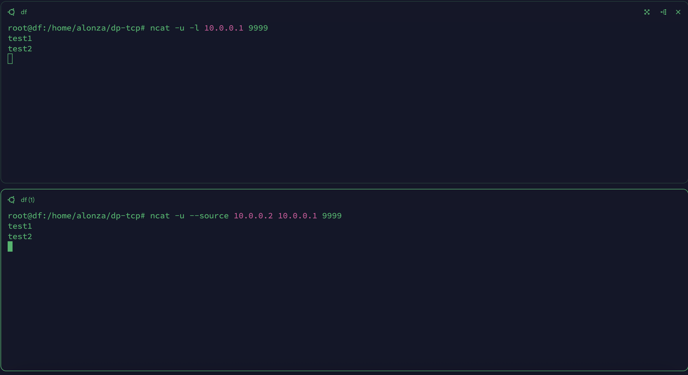

# dp-tcp

This is a layer 5 application for Dual-Path TCP.

Dual-Path at here means the packet will be ensure by double transmit.

## Usage

```bash
git clone git@github.com:Alonza0314/dp-tcp.git
cd dp-tcp
make
```

- Server

    ```bash
    sudo ./build/dp-tcp server -c config/server.yaml
    ```

- Client

    ```bash
    sudo ./build/dp-tcp client -c config/client.yaml
    ```

## Quickstart

1. Clone and make

    ```bash
    git clone git@github.com:Alonza0314/dp-tcp.git
    cd dp-tcp
    make
    ```

2. Start and enter namespace

    - Start

        ```bash
        ./namespace.sh up
        ```

    - Server-ns

        ```bash
        ./namespace.sh server-ns

        # after enter namespace
        ./build/dp-tcp server -c config/server.yaml
        ```

    - Client-ns

        ```bash
        ./namespace.sh client-ns

        # after enter namespace
        ./build/dp-tcp client -c config/client.yaml
        ```

    - Demo

        

3. ncat test

    - Server

        ```bash
        ncat -u -l 10.0.0.1 9999
        ```

    - Client

        ```bash
        ncat -u --source 10.0.0.2 10.0.0.1 9999
        ```

    - Demo

        

## Feature

- "github.com/songgao/water": used to bring up network device.
- "github.com/cornelk/hashmap": safe concurrent map.
- "github.com/cespare/xxhash/v2": quick hash for operating packet hashing
